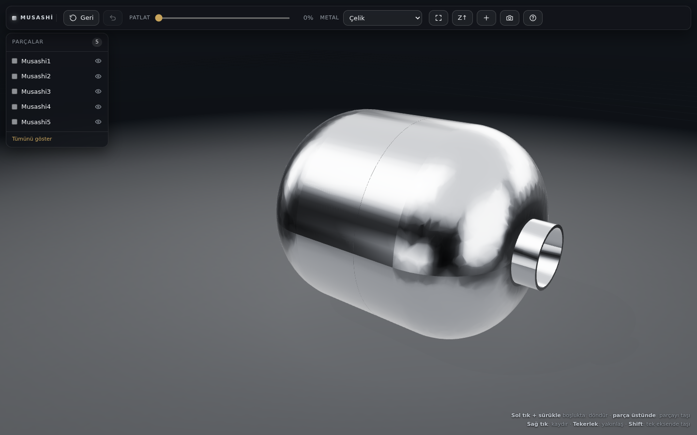

# STEP Görüntüleyici

Tarayıcıda çalışan bir STEP (CAD) görüntüleyici. STEP dosyalarını **gerçek metal
görünümüyle** açar; parçaları **fareyle tutup birbirinden ayırmanı**, **↺ Geri**
düğmesiyle hepsini tek tıkla ilk konumuna döndürmeni sağlar.

Kurulum gerekmez, hesap gerekmez, veri hiçbir yere gitmez: her şey kendi
bilgisayarında, tarayıcıda çalışır. Kütüphaneler depo içinde gömülüdür, yani
internet bağlantısı olmadan da açılır.

**Nasıl çalışıyor (özet):** STEP dosyaları NURBS yüzeylerden oluşur, ekran kartı
bunları doğrudan çizemez. OpenCascade'in WebAssembly derlemesi yüzeyleri üçgen ağa
çevirir; three.js bunları fizik tabanlı (PBR) metal malzemeyle, prosedürel bir
stüdyo ortamının yansımaları altında çizer. Metalin inandırıcılığı neredeyse
tamamen **yansıttığı ortamdan** gelir.



---

## 1. Çalıştırma (macOS)

### Masaüstüne kısayol koymak (bir kereye mahsus)

Depo klasöründeki **`masaustune_kisayol_koy.command`** dosyasına çift tıklayın.
Masaüstünüzde **“STEP Görüntüleyici”** adında bir kısayol oluşur; bundan sonra
programı hep oradan açabilirsiniz. Depoyu başka bir klasöre taşırsanız bu betiği
yeniden çalıştırın (kısayol içinde tam yol yazılıdır).

### Normal çalıştırma

1. STEP dosyalarını şu üç yoldan biriyle ver:
   - `musashi_viewer/models/` klasörüne kopyala, **veya**
   - Masaüstünde herhangi bir klasörde bırak (program STEP içeren klasörü kendisi arayıp bulur), **veya**
   - program açıldıktan sonra dosyaları pencereye sürükleyip bırak.
2. Masaüstündeki **“STEP Görüntüleyici”** kısayoluna — ya da depo klasöründeki
   `baslat.command` dosyasına — **çift tıkla**.
3. Tarayıcı kendiliğinden açılır. Kapatmak için Terminal penceresinde `Ctrl+C`.

> macOS "geliştirici doğrulanamadığı için açılamadı" derse: `baslat.command` üzerinde
> **sağ tık → Aç → Aç**. Bu yalnızca ilk seferde sorulur.

Belirli bir klasörü açmak için Terminal'den:

```bash
python3 sunucu.py "/Users/adiniz/Desktop/Musashi Kit"
```

---

## 2. Kullanım

| Ne istiyorsun | Nasıl |
|---|---|
| Modeli döndür | Boş alanda **sol tık + sürükle** |
| Yakınlaş / uzaklaş | **Fare tekerleği** (veya trackpad'de iki parmak) |
| Görüntüyü kaydır | **Sağ tık + sürükle** |
| **Parçayı elle tut ve ayır** | Parçanın **üstünde** sol tuşla tut, çek |
| Tek eksende taşı | Sürüklerken **Shift** basılı tut |
| **Her şeyi eski yerine getir** | Araç çubuğundaki **↺ Geri** (veya `R`) |
| Yalnızca son hareketi geri al | **⌘Z** ya da ⤺ düğmesi |
| Tüm parçaları otomatik ayır | **Patlat** kaydırıcısı |
| Parçaya yakınlaş | Parçaya **çift tık** (veya listede çift tık) |
| Metali değiştir | **Metal** menüsü — parça seçiliyse ona, seçim yoksa tümüne |
| Parçayı gizle / göster | Sol listedeki **göz** simgesi (veya seçiliyken `H`) |
| Ekrana sığdır | **⛶** düğmesi veya `F` |
| Görüntüyü PNG kaydet | **Fotoğraf** düğmesi |
| Model yan yatmışsa | **Z↑ / Y↑** düğmesi |

Taşınmış parçalar sol listede küçük altın noktayla işaretlenir; **↺ Geri**
düğmesi bir şey taşındığında altın renge döner.

---

## 3. Sık karşılaşılan durumlar

**Parçalar üst üste yığılmış görünüyor.**
Dosyalar CAD'den kendi yerel orijinlerinde dışa aktarılmış demektir (montaj
koordinatlarıyla değil). Çözüm: **Patlat** kaydırıcısıyla ayırın ya da parçaları
tek tek elle çekin. Kalıcı çözüm için CAD programından "montaj konumunda / assembly
coordinates" seçeneğiyle yeniden dışa aktarın.

**Model yan yatmış duruyor.** STEP dosyaları genelde Z-yukarı, three.js Y-yukarı
çalışır. Araç çubuğundaki **Z↑ / Y↑** düğmesi bunu çevirir.

**Yükleme uzun sürdü / pencere bir an dondu.** STEP'in üçgenlenmesi ağır bir
hesap ve tarayıcıda tek iş parçacığında çalışır. 25 MB üstü dosyalarda program
otomatik olarak daha kaba (hızlı) üçgenlemeye geçer.

**`index.html`'e çift tıkladım, boş ekran geldi.** Tarayıcılar `file://`
adresinden WebAssembly ve modül yüklemeye izin vermez. `baslat.command`
kullanın — zaten tek yapması gereken küçük bir yerel sunucu açmak.

**"Python 3 bulunamadı" yazdı.** Terminal'de `xcode-select --install` çalıştırın.

---

## 4. Nasıl çalışıyor

| Katman | Ne yapıyor |
|---|---|
| `vendor/occt/` | OpenCascade'in WebAssembly derlemesi (`occt-import-js`). STEP'teki NURBS yüzeyleri üçgen ağa çevirir — ekran kartı B-rep çizemez. |
| `app/stepLoader.js` | Bu üçgenleri `THREE.BufferGeometry`'ye dönüştürür. Bir dosya = bir parça. |
| `app/studio.js` | Prosedürel stüdyo ortamı (karanlık oda + softbox'lar) → PMREM ile ortam haritası. Metalin gerçekçiliği neredeyse tamamen **yansıttığı ortamdan** gelir. |
| `app/materials.js` | PBR metal ön ayarları: `metalness = 1`, farklı `roughness` değerleri. |
| `app/parts.js` | **Her parçanın ilk konumu burada saklanır.** Konum = ev + elle taşıma + patlatma. ↺ Geri'nin dayandığı yer burasıdır. |
| `app/interactions.js` | Işın testiyle parçayı bulur, kameraya paralel bir düzlem üzerinde sürükler. |
| `sunucu.py` | Küçük yerel sunucu; STEP dosyalarını bulur, `/api/models` ile listeler. |

---

## 5. Test

Otomatik tarayıcı testi (Playwright gerekir; isteğe bağlı):

```bash
python3 sunucu.py /yol/test_step_dosyalari --port 8791 --no-browser &
npm i playwright
OUT_DIR=/tmp/shots VIEWER_URL=http://127.0.0.1:8791/ node test/test_viewer.mjs
```

Test; yükleme, WebGL çizimi, sürükleme, ⌘Z, patlatma, **↺ Geri**, metal değişimi
ve eksen düğmesini uçtan uca doğrular ve ekran görüntüleri kaydeder.
